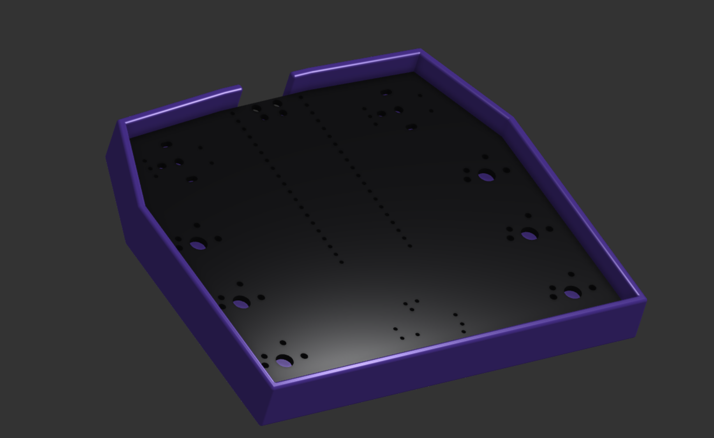
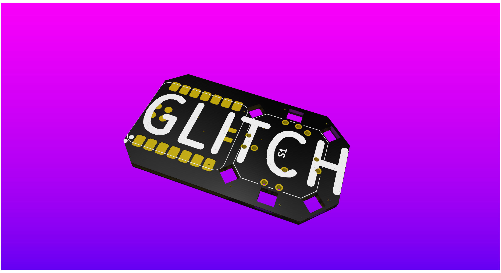

Total Hours: 9

## On the plane: 6/12/25
Hours: 5
On my flight to montana I made the schematic and pcb because I was bored.

## In Montana: 6/14/25
Hours: 1
Made a simple case in onshape to keep it off my desk

## Finishing it up: 6/18/25
Hours: 3
Sourced parts, made a BOM, wrote the readme, and submitted.

## Redoing it: 7/8/25
Hours: 4
I realized that I really only needed the 7-way switch in this, so I redid the whole project to be a lot more minimalistic and task-focused. 

